# Skyrider Drone Control

## Introduction
This project autonomously controls a [Sky Rider X-31 Shockwave drone](https://www.homedepot.com/p/SKY-RIDER-Pro-Quadcopter-Drone-with-Wi-Fi-Camera-Remote-and-Phone-Holder-DRW331MG/317271890). This drone is WiFi-enabled, allowing a user to control the drone from a smartphone by connecting to the drone's WiFi access point. A camera on the drone streams video to the phone, and the phone has joystick input to control the drone. Inspiration for this project comes from two sources. The first is a [blog post](https://lemaizi.com/blog/hacking-a-toy-drone-to-put-artificial-intelligence-on-it-part-i-the-hack/) describing how someone packet sniffed the data being sent between the drone and the smartphone to intercept the video feed and send commands to the drone. The second is an [infosec article](https://infosecwriteups.com/lets-see-how-easy-it-is-to-hack-someone-s-drone-camera-and-get-live-video-access-19fbdab34f3f?gi=741b8cb16620) showing the insecurity of these cheap drones, also intercepting the feed. I used methods from both of these examples to achieve control over the drone.

## Video Feed Interception

To control the drone autonomously, I need to be able to estimate the state of the drone. Normally, a drone has access to accelerometers, altimeters, GPS, and other sensors to estimate state. Because this is a cheap drone, it probably only has an accelerometer to estimate state, evident by the fact that the drone drifts while in hover mode. Seeing how I don't have access to accelerometer data, computer vision is the only method I have to estimate drone state. This gives me my first objective: to intercept the video feed from the drone.

### Method 1: Packet sniffing with Wireshark
The blog post mentioned above packet-sniffed the drone feed to intercept the video. I decided to try the same method, but use Wireshark to sniff packets instead of using a smartphone packet sniffer. There are two methods to do this. I can either connect to the same drone network from a third device and monitor traffic on the network, or use a third device in monitor mode to read packets from all nearby networks on a specific channel. With a Windows laptop, the WiFi chip does not provide support for monitor mode. That leaves one option: connecting both the smartphone and the laptop to the drone's access point. But there's an issue. The drone kicks off anyone who tries to connect to it after the first connection. I'm left with hoping I can borrow a friend's Mac unless there is a workaround. Just before giving up on my laptop, I thought of trying one last thing. My laptop allows you to use it as a hotspot. So I connected the laptop to the drone, started the hotspot, then connected my phone to the hotspot. I launched the app and... success! I was able to control the drone from the app on my phone. It didn't work very well with some lag, a lack of responsiveness, and no video feed, but data was being received by the drone. This meant I could sniff the packets on my laptop. Here's what I found.

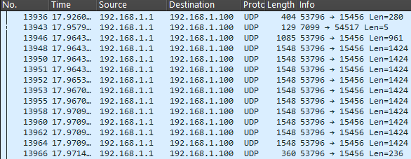


The drone's IP is 192.168.1.1, and the phone is 192.168.1.100. The drone is constantly sending groups of ten or so packets, each 1.5 kilobytes, and each group is sent every 0.05 seconds. That sure seems like a video connection to me. When I dived into the hex, I noticed a few things. The footers looked like the end of JPEG images. The headers looked like the start of JPEG headers for the DCT coefficients. But the headers were missing a significant amount of header information I'd expect from a JPEG image. I tried and failed to force these packets into a JPEG image, going so far as to create fake headers just to get some image to pop up. After a while, I decided to try the method from my other inspiration.

### Method 2: Reverse engineerning
The second resource for this project took a different approach. They simply wanted to see if they could intercept the video from a cheap drone as a test in information security. Their method was to reverse engineer the app and use the information gained there to find how to receive the stream. To reverse engineer the code, I downloaded the APK for Skyrider Cruise from apkpure.com. I then used apktool to analyze the APK. The output folders separated into Android-essential code and the code for app function itself. I used grep on the .smali files in the app code for anything with "rtsp://". At the bottom of the output, you can see what looks like a URL for a webcam. That looks right. And wouldn't you know it, but the URL I found is the exact same RTSP URL that my resource found. Once I connected to the drone and started a Python script to stream RTSP using OpenCV, the drone's video stream popped up on my PC.
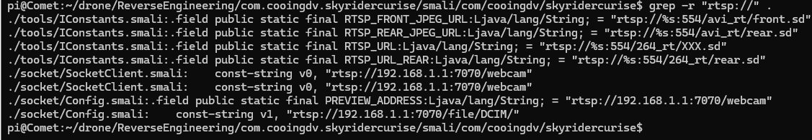

## Sending commands to the drone
While the first method for getting the video didn't work for me, it did show me the other packets sent between the drone and the smartphone. Maybe I could analyze those to figure out how to control the drone. Three types of packets were being sent regularly. One was a two-byte packet being sent every one second and was consistently "0x01 0x01". Another was a four-byte packet being sent every 0.1 seconds and was consistently "0xEF 0x00 0x04 0x00". The last was a nine-byte packet that changed as I used the joysticks on the phone app. That is what I needed.
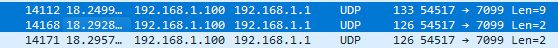

The blog post got stuck here. He could send those packets to the drone, and the drone would pair, but his project ended before determining how to construct the packets from joystick positions. A commenter suggested watching how the packets change with the joystick inputs. While that could work, I was curious if the reverse-engineered code would lend any more help. By using grep and searching for "control", a notable file pops up:

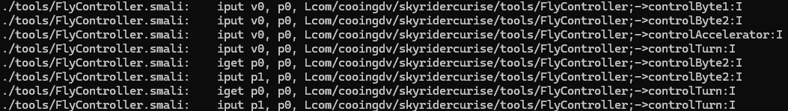

These functions look like getters for the joystick inputs. These getters have to be used somewhere, and that place likely sends the packets after getting the joystick inputs. If we now grep with the word "send", we see another couple of interesting entries in the output:


Looking into FlyController$FlyControlTask.smali shows that the send command is called in a run() function. This function gets the joystick positions and controller flags, constructs a byte array from the outputs, then sends the byte array. I gave an LLM the reverse-engineered code and asked it to provide a more readable version with correct variable names (the getters just look like access700(), access800() etc).

```JAVA
packet[0] = (byte) 0x66;
packet[1] = (byte) controlByte1;
packet[2] = (byte) controlByte2;
packet[3] = (byte) controlAccelerator;
packet[4] = (byte) controlTurn;
packet[5] = (byte) flagsByte;
packet[6] = (byte) checksum;
packet[7] = (byte) 0x99;
```

The control bytes represent the two joystick inputs. Byte1 represents roll, byte two is pitch, accelerator is throttle, and turn is yaw. In hover mode, the mode I mainly use, these are centered at 128. The user is allowed to trim these to prevent drift. 

## Autonomous Control
As a first step into autonomous control, I decided that finding the trim values for stable flight was an important step. There are multiple CV algorithms to choose from, but to start off I looked into the camera I have to work with. The images coming back are 640x480 with an approximately 75 degree field of view. You can't expect much from a $35 drone, and the noisiness of the image lends to its price as well. Here is an example frame taken from the drone at approximately 20 ft away from the doors.

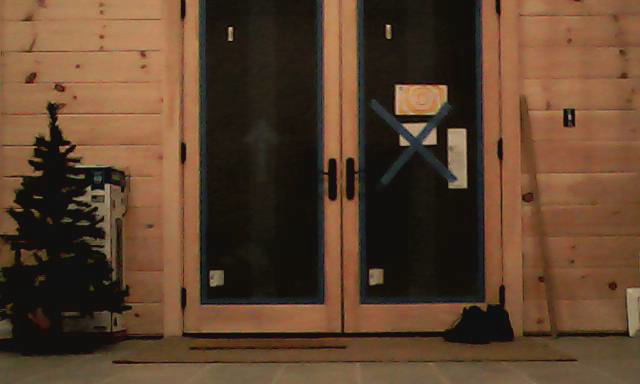


With the limited sensing ability, I narrowed my goal to a milestone: minimizing roll-based drift. With a forward-facing camera, horizontal drift should be relatively easy to measure. Drift along the axis of the camera is a harder problem to solve, as you have to estimate velocity from inward and outward expansion of the image.

Eventually, I may want to run this on a microcontroller, so the lighter weight the algorithm the better. The two algorithms I tried were dense optical flow and the first half of the SLAM algorithm, namely feature tracking. To test these features, I took a video with the drone of it taking off, moving left, moving right, then landing. I compared how well the algorithms were able to estimate horizontal velocity from the video. Once I found an algorithm that performed reasonably well, I would run a PID controller on the velocity to minimize drift.


### Dense Optical Flow
In my research, I found a tutorial for optical flow from [OpenCV](https://docs.opencv.org/4.x/d4/dee/tutorial_optical_flow.html). Dense optical flow attempts to make a vector field for the motions of the pixels between two images. For each pixel, a vector is calculated that represents the motion of that pixel from one image to the next. While Farneback is susceptible to large rotations, the drone shouldn't be making large roll commands while just trying to trim the drone. The other issue is that the fundamental assumption for Farneback is that brightness does not change between images. The drone camera will change its ISO depending on the lighting conditions, so this will also introduce noise. The results weren't great, but show some promise. This is what the output of the dense optical flow looked like. 

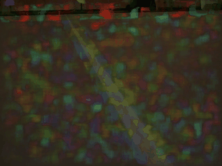

This optical flow has both an x and y component. Red pixels mean a positive x displacement, and blue means a negative x displacement.

To get an estimated velocity of the drift, I took the average of all of the horizontal components of the vector field. That yielded these results:

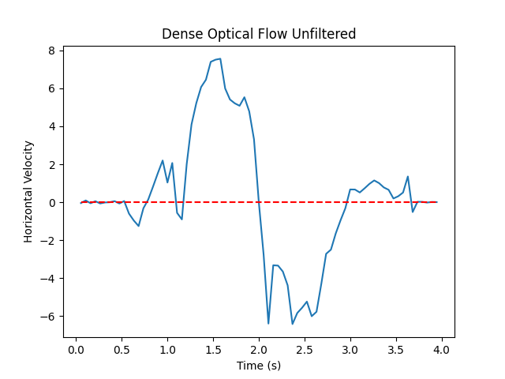

As you can see from the results, there is significant noise. It is likely that this much noise would be too much for a PID controller to stabilize. I attempted a few methods of signal processing to reduce the noise. First, there are a lot of areas of the optical flow mask that have zero velocity. I applied two filters. The first is a popular vote. If there are more pixels with a negative horizontal velocity, I only use those pixels to estimate velocity, and vice versa. I then used a high-pass filter to get the pixels that had the highest 20% horizontal magnitude. With these two filters in place, I got these results from the test video:

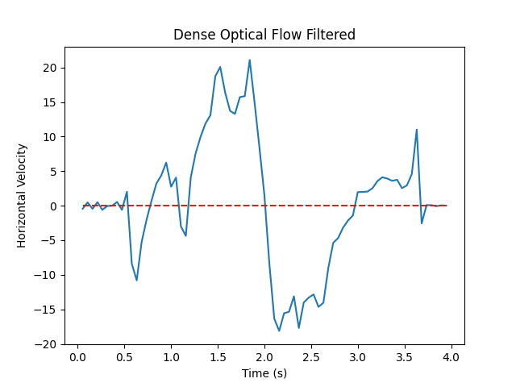


Even with the filtering, the noise is still high. And there was still one thing I haven't tested yet: processing time. Once I timed the algorithm, I found that it was taking approximately 0.25 seconds per frame. This meant that I was missing 4 frames of data. This is partially to my benefit. Because the drone is moving slowly, the small velocity movements I'm trying to eliminate are hard to determine between consecutive frames. Skipping frames amplifies the movement, possibly making it easier for the algorithms to determine pixel movement. I would rather the frame skipping be deliberate rather than a consequence of high processing times, as the introduction of a microcontroller could increase the processing time significantly. After resizing the frame to 320x240, I was able to process each frame at 0.04 seconds per frame.


### Monocular SLAM (lite)
The SLAM algorithm attempts to map out the surroundings of a moving camera and estimate the position/pose of the camera in that space. I used [LearnOpenCV](https://learnopencv.com/monocular-slam-in-python/)'s implementation of the algorithm. Because my problem is a subset of estimating one component of the velocity of the drone, I can remove much of the computationally-heavy functionality of the algorithm. The algorithm starts with getting a set of descriptors using goodFeaturesToTrack, then converting them to Oriented FAST and Rotated BRIEF (ORB) descriptors. I then get another set of descriptors from the next received image. A k-nearest neighbor matching algorithm is used to determine descriptor matches between frames. A Lowe's ratio test filters out matches that are too far, and RANSAC is used to determine inliers. Once I have those filtered matched descriptors, I calculate the pixel difference between the descriptors, then average that value to get the estimated velocity. This algorithm has many limitations, namely that it isn't robust to changes in scene depth. It would be more accurate to estimate the position of features in real-world coordinates, then determine pose, but the noisiness of the camera, the small field of view, and the requirement of low computational cost limit that option. The following is the result of this algorithm:

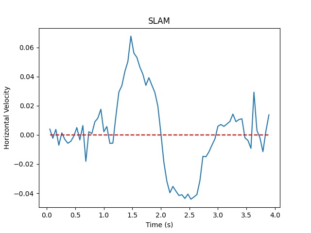

This method took an average of 0.06 seconds per frame to compute the velocity. In the end, I chose the SLAM approach. If I want to make the algorithm more accurate, doing pose estimation might help increase the accuracy of the velocity, and getting more familiar with SLAM will help me with that. 

### PID Control

To stabilize the drone, I use an LLM to implement a PID loop class. I feed the PID controller the calculated velocity and update the roll trim value from the output. Just gaining familiarity with PID controllers, I decided to simulate the behavior of the drone to get approximate coefficients for tuning the PID controller. I knew the drone quickly reaches an approximately constant speed for any constant joystick position. I modeled this by letting the joystick position determine the force applied to an object. Then I simulated quickly reaching a constant velocity by adding a high drag coefficient force to the joystick force. Knowing that I would have to tune my unitless force anyway, I disregarded entering the drone mass in favor of tuning the force coefficients by hand. Once the steady state velocity looked like the output from the algorithm, I started tuning the PID controller. These are some of the results of the tuning:

<table>
  <tr>
    <td>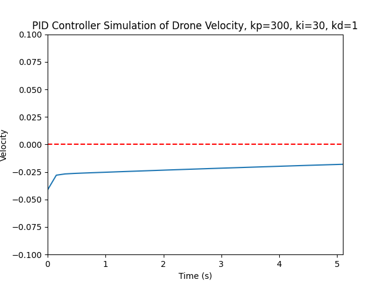</td>
    <td>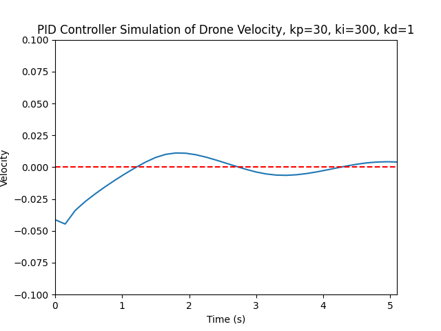</td>
    <td>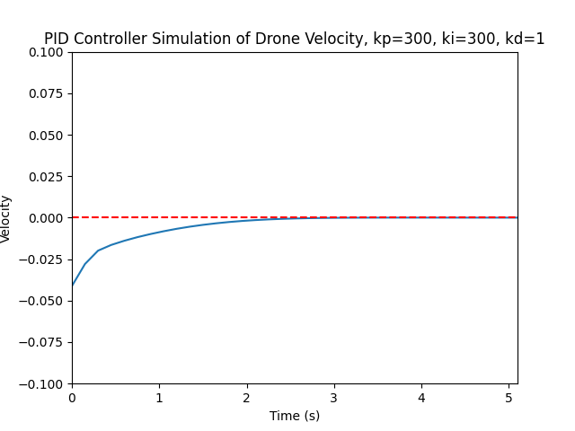</td>
  </tr>
</table>

With that test done, I started experimenting on the drone itself. I first launch the drone, then after it settles from its launch sequence, I initialize the computer vision algorithm and stabilize with the PID controller. After a few tests, I landed on coefficients that are able to hold the drone fairly steady. 

The below GIF is the drone flying without any PID stabilization. I tell the drone to take off, then let it stay in hover mode.


The next GIF is the drone flying with PID stabilization. I first take off, let it settle for a second, then turn on PID stabilization. It still drifts horizontally, as the PID is controlling the velocity, not absolute drone position, so small changes in velocity can add up to larger positional errors. For this test, I used kp=100, ki=500, and kd=10:


The PID controller still needs tuning. I tried used what I found from my simulation: kp=300, ki=300, and kd=10: 


The tuning is better, but it could be refined more. I also tested both algorithms during the day, when the light through the double doors blows out the camera sensors. While the drone still has objects in its field of view it could use for velocity estimation, the algorithms seem susceptible to both the blown out pixels and the camera changing ISO for the lighting conditions.

## Next Steps
### PID Tuning and Algorithm Generalization
Befor moving on, it would be better if the drone has better tuning and more robustness against differing lighting conditions. While this is a good first step, the hardware will let me accomplish more if I can find the right methods. Namely, I first need to be able to stabilize the drone in the pitch axis.

### Pitch Stabilization
Being able to stabilize in the roll axis won't help me much if I can't also stabilize in the pitch axis. It is a more difficult problem to solve as it involves estimating the expansion and contraction of a scene in time. There are things I could do to mitigate this, such as trying to reposition the camera to point more downwards.

### Ascent/Descent Stabilization
The drone does a better job of stabilizing itself vertically, but it could be made better, especially if I have spare computational power.

Trying to stabilize in three axes lends to the idea that I do need to estimate pose, and use the PID controller on the translation vector's components. Also, my next step will require position stabilization instead of velocity stabilization.

### Autonomous Landing
Repositioning the camera and stabilizing the drone's position can also help with a major milestone: getting the drone to land in a specific location. With a narrow field of view that faces forward, it would be hard to estimate the drone's position well enough to land on a target out of view. If I instead point the camera downwards enough to keep a landing target in view, I may just be able to land on it accurately.


# Software Usage

main.py shows an example usage for the drone flight controller, the PID controller, and the velocity estimator. A user starts a thread collecting frames using get_latest_frame in main.py. This loop attempts to clear the buffer, so that when main grabs a new frame, it is the most up-to-date frame, regardless of how long the frame processing algorithm takes. In practice, the thread could be blocked if the core is at or near capacity, or if the frame processing blocks the GIL. 


Once that thread is running, the user has the option for how to control the drone. In this project, the keyboard library is used to control the drone using WASD for lateral movements, Q/E for yaw, and shift/ctrl for ascent/descent. Flags for different modes are set by the following:
- Up: Fast fly, tells the drone to take off from the ground.
- Down: Fast drop, tells the drone to land.
- Esc: Emergency stop. Immediately shuts off all motors.
- C: Circle turn end. I haven't observed this flag's behavior yet.
- N: No head mode. I haven't observed this flag's behavior yet.
- G: Gyro correction. I believe this is for resetting the drone's orientation before takeoff.

To reduce the control authority of the movement keys, hold space while using the movement keys. To trim each axis, hold enter and press the corresponding key.

When the user presses P, it turns on autopilot. Autopilot uses the algorithm described above with a PID controller to minimize the drift in the roll axis. Pressing P again disables and resets the autopilot.
